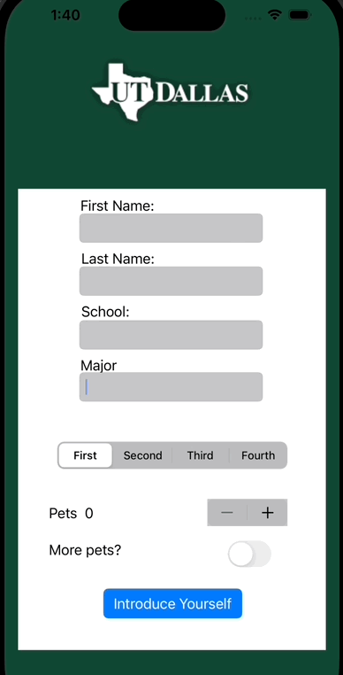

## INTRODUCTION APP

### App Description

My first swift application. This app ask the user to provide their full name, school name, major, year of study, how many pets they have and if they want more. Once the user fills out that, they can press the "Introduce youself button" where they will be met with a popup that is an introduction with their provided information

### App Walk-though

### Required Features

- [x] 1. App displays an image of a school's logo
- [x] 2. App has three textfields for first, last, and school names
- [x] 3. App has a segmented control that changes student year
- [x] 4. Number of pet matches label is increased/decreased by stepper
- [x] 5. Switch makes a statement about wanting more pets or not(true/false) 
- [x] 6. Introduce yourself button shows alert box with an introduciton and dismiss button

### Optional Features

- [x] 1. There is an additional text field that the user type in to provide their major/area of study. writing in that text field will also add into the introduction message
- [x] 2. One style issues I had was selecting multiple textboxes and have the verticle distance between all of them be equal. I got a little familiar with Visual Basic awhile back and wanted a system similar to them, you could select multiple objects and make it to where the space(verticle or horizontal) between all of them matched perfectly.I'm sure there is a way but I just couldnt find it.
